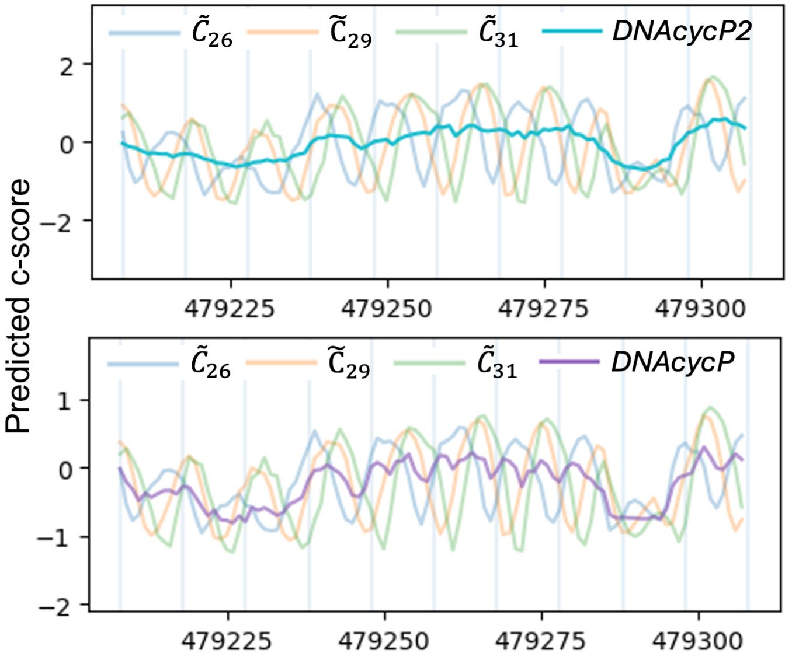

DNAcycP2 R package 
================

**Maintainer**: Ji-Ping Wang, \<<jzwang@northwestern.edu>\>; Brody Kendall \<<curtiskendall2025@u.northwestern.edu>\>; Keren Li, \<<keren.li@northwestern.edu>\>

**License**: Artistic-2.0

**Cite DNAcycP2 package**:

TODO: Update citation when applicable


## What is DNAcycP2?

**DNAcycP2**, short for **DNA** **cyc**lizablity **P**rediction v**2**, is an R package for accurate, unbiased prediction of DNA intrinsic cyclizablity score. It was built upon a deep learning architecture with a hybrid of Inception and Residual network structure and an LSTM layer. DNAcycP2 is an updated version of DNAcycP, released by Li et al 2021 (see below). DNAcycP was trained based on loop-seq data from Basu et al 2021 (see below), while DNAcycP2 was trained based on smoothed predictions of this loop-seq data. The predicted score (for either DNAcycP or DNAcycP2), termed **C-score** achieves high accuracy compared to the experimentally measured cyclizablity score by loop-seq assay.

## Key differences between DNAcycP2 and DNAcycP

Following the release of DNAcycP, it was discovered that the training data contained residual measurement bias, leading to biased predictions. To correct this bias in the data, we employed a data augmentation + periodic smoothing approach to generate new, unbiased estimates of intrinsic DNA cyclizability for each sequence in the original training dataset. We then trained a new model on the unbiased data with architecture identical to that of DNAcycP, named DNAcycP2. More details on this process can be found in the following paper: (CITATION).

TODO: fill in citation above

Previously, the measurement bias introduced by the location of the biotin tether was not adequately accounted for. By employing data augmentation and smoothing with a moving average approach over the length of 1 full helical repeat at 1bp resolution in the genome, we can remove this bias while still maintaining high resolution, accurate estimates of intrinsic cyclizability.



## Available formats of DNAcycP2 and DNAcycP

DNAcycP2 is available in three formats: A web server available at http://DNAcycP.stats.northwestern.edu for real-time prediction and visualization of C-score up to 20K bp, a standalone Python package avilable for free download from https://github.com/jipingw/DNAcycP2, and an R package available for free download from https://github.com/jipingw/dnacycp2-R.

TODO: update web server - possible selection on server of which model to use?

DNAcycP is still available in its two original formats: A web server available at http://DNAcycP.stats.northwestern.edu for real-time prediction and visualization of C-score up to 20K bp, and a standalone Python package available for free download from https://github.com/jipingw/DNAcycP

## Architecture of DNAcycP2

The core of DNAcycP2 is a deep learning architecture mixed with an Inception-ResNet structure and an LSTM layer (IR+LSTM, Fig 1b) that processes the sequence and its reverse complement separately, the results from which are averaged and detrended to reach the predicted intrinsic score. (Fig 1a).

IR+LSTM starts with a convolutional layer for dimension reduction such that the encoded sequence space is reduced from 2D to 1D. The output is fed into an inception module that contains two parallel branches, each having two sequentially connected convolutional layers with branch-specific kernels to capture sequence features of different scale. The first branch has kernel dimension 3x1 for both layers and the second has kernel dimension 11x1 and 21x1 sequentially. The output of the inception module is combined by concatenation and added back to the input of the inception module to form a short circuit or residual network. Finally, the IR+LSTM concludes with a dense layer to predict output with linear activation function. 


## DNAcycP2 required packages

* `basilisk`
* `reticulate`

## Installation

Current best practice is to install via `devtools` and github:

```r
devtools::install_github("brodykendall/dnacycp2-R")
```


## Usage

Upon successful installation, the DNAcycP2 R package supports the input sequence in two formats: FASTA format (with sequence name line beginning with “>”) or directly as an R object. Unlike in the web server version where only one sequence is allowed in input for prediction, the R package allows multiple sequences in the same input file/object. In particular for the R object format, each sequence (which can be of length >= 50bp) in the file is regarded as one input sequence for prediction, however the computation is most efficient when every sequence has length exactly 50bp.

The two main functions in the package are `cycle` and `cycle_fasta`, both of which perform cyclizability prediction. The main difference between the two functions is the input type: `cycle` takes an R object as its input, while `cycle_fasta` takes a file path as its input. Both take an additional argument `smooth` which determines which model to use in making predictions:
* `smooth=TRUE`: DNAcycP2 (the model trained on smoothed data, recommended) 
* `smooth=FALSE`: DNAcycP (the model trained on the original data).

The `cycle_fasta` function is designed for larger files, so it has added parallelization capability. To utilize this capability, specify the number of cores to be greater than 1 using the `n_cores` argument (default 1). You can also specify the length of the sequence that each core will predict on at a given time using the `chunk_length` argument (default 100000).

For reference, on a personal computer (16 Gb RAM, M1 chip with 8-core CPU), prediction at full parallelization directly on the yeast genome FASTA file completes in 12 minutes, and on the hg38 human genome Chromosome I FASTA file in just over 4 hours. In our experience, selection of parallelization parameters (`n_cores` and `chunk_length`) has little affect when making predictions on a personal computer, but if using the package on a high-performance compute cluster, prediction time should decrease as the number of cores increases. If you do run into memory issues, we first suggest reducing `chunk_length`.

We provide two simple example files with the package to show proper usage:

### Example 1:

```r
ex1_file <- system.file("data", "ex1.fasta", package = "dnacycp2")
ex1_smooth <- dnacycp2::cycle_fasta(ex1_file,smooth=TRUE,n_cores=2,chunk_length=1000)
ex1_original <- dnacycp2::cycle_fasta(ex1_file,smooth=FALSE,n_cores=2,chunk_length=1000)
```

`cycle_fasta` takes the file path as input (`ex1_file`)

`smooth=TRUE` specifies that DNAcycP2 be used to make predictions

`smooth=FALSE` specifies that DNAcycP be used to make predictions

`n_cores=2` specifies that 2 cores are to be used in parallel

`chunk_length=1000` specifies that each core will predict on sequences of length 1000 at a given time

The output (`ex1_smooth` or `ex1_original`) is a list with names starting with "cycle"

For example, `ex1.fasta` contains two sequences with IDs "1" and "2" respectively.

Therefore, both `ex1_smooth` and `ex1_original` will be lists of length 2 with names `cycle_1` and `cycle_2` for the first and second sequences respectively.

Each item in the list (e.g. `ex1_smooth$cycle_1`) is a data.frame object with three columns. The first columns is always `position`. When `smooth=TRUE`, the second and third columns are `C0S_norm` and `C0S_unnorm`, and when `smooth=FALSE` the second and third columns are `C0_norm` and `C0_unnorm`. The predicted C-score for either model is the normalized output (`C0S_norm` and `C0_norm`), the predictions from the model trained based on the standardized loop-seq score (in the case of DNAcycP) or the standardized smoothed intrinsic cyclizability estimate (in the case of DNAcycP2) of the Tiling library of Basu et al 2021 (i.e. 0 mean unit variance). When predictions are made using the original DNAcycP (`smooth=FALSE`), `C0_unnorm` is the predicted C-score recovered to the original scale of loop-seq score in the Tiling library data from Basu et el 2021. When predictions are made using the updated DNAcycP2 (`smooth=TRUE`), `C0S_unnorm` is the predicted C-score recovered to the scale of standardized raw cyclizability scores of the Tiling library data. The standardized scores provide two advantages. As loop-seq may be subject to a library-specific constant, standardized C-score is defined with a unified baseline as yeast genome (i.e. 0 mean in yeast genome). Secondly, the C-score provides statisitcal significance indicator, i.e. a C-score of 1.96 indicates 97.5% in the distribution.

### Example 2:

```r
ex2_file <- system.file("data", "ex2.txt", package = "dnacycp2")
ex2 <- read.csv(ex2_file, header = FALSE)
ex2_smooth <- dnacycp2::cycle(ex2$V1, smooth=TRUE)
ex2_original <- dnacycp2::cycle(ex2$V1, smooth=FALSE)
```

`cycle` takes the sequences themselves as input, so we first read the file (`ex2_file`) and then provide the sequences as input (`ex2$V1`)

`smooth=TRUE` specifies that DNAcycP2 be used to make predictions

`smooth=FALSE` specifies that DNAcycP be used to make predictions

The output (`ex2_smooth` or `ex2_original`) is a list with indices corresponding to each sequence from the `sequences` argument (here it is `ex2$V1`).

For example, `ex2.txt` contains 100 sequences.
Therefore, both `ex2_smooth` and `ex2_original` will be lists of length 100, 
where each entry in the list corresponds to the sequence with its same index.

Each item in the list (e.g. `ex2_smooth[[1]]`) is a data.frame object with three columns. The first columns is always `position`. When `smooth=TRUE`, the second and third columns are `C0S_norm` and `C0S_unnorm`, and when `smooth=FALSE` the second and third columns are `C0_norm` and `C0_unnorm`. The predicted C-score for either model is the normalized output (`C0S_norm` and `C0_norm`), the predictions from the model trained based on the standardized loop-seq score (in the case of DNAcycP) or the standardized smoothed intrinsic cyclizability estimate (in the case of DNAcycP2) of the Tiling library of Basu et al 2021 (i.e. 0 mean unit variance). When predictions are made using the original DNAcycP (`smooth=FALSE`), `C0_unnorm` is the predicted C-score recovered to the original scale of loop-seq score in the Tiling library data from Basu et el 2021. When predictions are made using the updated DNAcycP2 (`smooth=TRUE`), `C0S_unnorm` is the predicted C-score recovered to the scale of standardized raw cyclizability scores of the Tiling library data. The standardized scores provide two advantages. As loop-seq may be subject to a library-specific constant, standardized C-score is defined with a unified baseline as yeast genome (i.e. 0 mean in yeast genome). Secondly, the C-score provides statisitcal significance indicator, i.e. a C-score of 1.96 indicates 97.5% in the distribution.

If every sequence has length exactly 50bp (recommended), the computation will perform significantly faster.

### Example 3 (Single Sequence):

If you want the predict C-scores for a single sequence, you can follow the same protocol as Example 1 or 2, depending on the input format. We have included two example files representing the same 1000bp stretch of S. Cerevisiae sacCer3 Chromosome I (1:1000) in .fasta and .txt format.

First, we will consider the .fasta format:

```r
ex3_fasta_file <- system.file("data", "ex3_single_seq.fasta", package = "dnacycp2")
ex3_fasta_smooth <- dnacycp2::cycle_fasta(ex3_fasta_file,smooth=TRUE)
ex3_fasta_original <- dnacycp2::cycle_fasta(ex3_fasta_file,smooth=FALSE)
```

The output (`ex3_fasta_smooth` or `ex3_fasta_original`) is a list with
 1 entry named "cycle_1".

Let's say we are interested only in the smooth (DNAcycP2), normalized
predictions for the subsequence defined by the first 100bp 
(corresponding to subsequences defined by regions [1,50], [2,51],
..., and [51-100], or `position`s 25, 26, ..., and 75). We can 
access the outputs for this subsequence using the following command:

```r
ex3_fasta_smooth[[1]][1:51,c("position", "C0S_norm")]
```

Or, equivalently,

```r
ex3_fasta_smooth$cycle_1[1:51,c("position", "C0S_norm")]
```

Next, we will consider the .txt format:

```r
ex3_txt_file <- system.file("data", "ex3_single_seq.txt", package = "dnacycp2")
ex3_txt <- read.csv(ex3_txt_file, header = FALSE)
ex3_txt_smooth <- dnacycp2::cycle(ex3_txt$V1, smooth=TRUE)
ex3_txt_original <- dnacycp2::cycle(ex3_txt$V1, smooth=FALSE)
```

The output (`ex3_txt_smooth` or `ex3_txt_original`) is a list with 1 entry (unnamed).

Note, that `ex3_fasta_smooth` and `ex3_txt_smooth` are essentially equivalent. 
The only exceptions are perhaps slight rounding differences that come from the 
computation, and that the list `ex3_fasta_smooth` has named entries ('cycle_1') 
while `ex3_txt_smooth` does not. The same applies for `ex3_fasta_original` and 
`ex3_txt_original`.

Therefore, we can use a similar command to access the outputs for our subsequence of interest:

```r
ex3_txt_smooth[[1]][1:51,c("position", "C0S_norm")]
```

## Other References

* Li, K., Carroll, M., Vafabakhsh, R., Wang, X.A. and Wang, J.-P., DNAcycP: A 
Deep Learning Tool for DNA Cyclizability Prediction, *Nucleic Acids Research*, 
2021

* Basu, A., Bobrovnikov, D.G., Qureshi, Z., Kayikcioglu, T., Ngo, T.T.M., 
Ranjan, A., Eustermann, S., Cieza, B., Morgan, M.T., Hejna, M. et al. (2021) 
Measuring DNA mechanics on the genome scale. Nature, 589, 462-467.